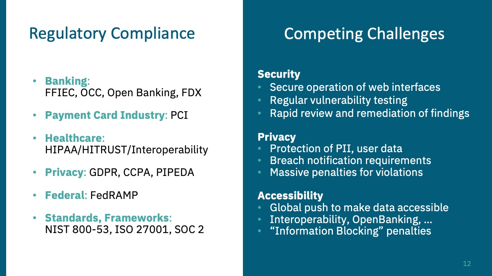

# Getting-Started-in-API-Pen-Testing
## Key Conceptes
### 4 Attack vectors for API Security
- Authentication & Authorization.
- Excessive Data exposure
- Mass Assignment
- Rate limiting

### 3 ways to test APIs
- SAST
- DAST ex API Scanner Burp Suite Web Vulnerability Scanner
- HAST Human AST create reusable context aware test that you can automate ex. Postman Collection Runner.

### Before Testing
- Questions to ask
    * What is the API Architecture (SOAP, GRAPHQL, REST, RPC, ....)
    * What kind of Test? White, Black, Grey
    * Which env? Prod, Test, Pre-pro, ....
    * What type of Authentication? Basic, OUATH2.0, None, ....
    * what are different users Roles? Low-Priv, User, Admin, ....
    * Documentation? OpenAPISPecs, ReferenceDocs, ....
- Must-Do Tasks
    * Use the API as it's designed.
    * write down the usecases to create the checklist.
    * Create/Adopt an API testing methodology.
- Tools to Pick
    * Document the Daily findings JOPLIN, OBSIDIAN, CHERRY TREE, .....
    * Hack the API BURP SUITE, POSTMAN, APISEC Scan, SQLMAP, OWASP ZAP

### During Testing
- Tips
    * OWASP ASVS
    * Use AI "POSTMAN POSTBOT", "Hacking APIs GPT", "Pentest GPT"
    * OPENAPI pecificatio OAS check OPENAPI Tools
    * MIND API Project 

### After Testing
- Exective Summary
- Scope     outlining target systems and boundaries.
- Methodology
- Findings
- Recommendations
- Conclusion

- <figure>  </figure>